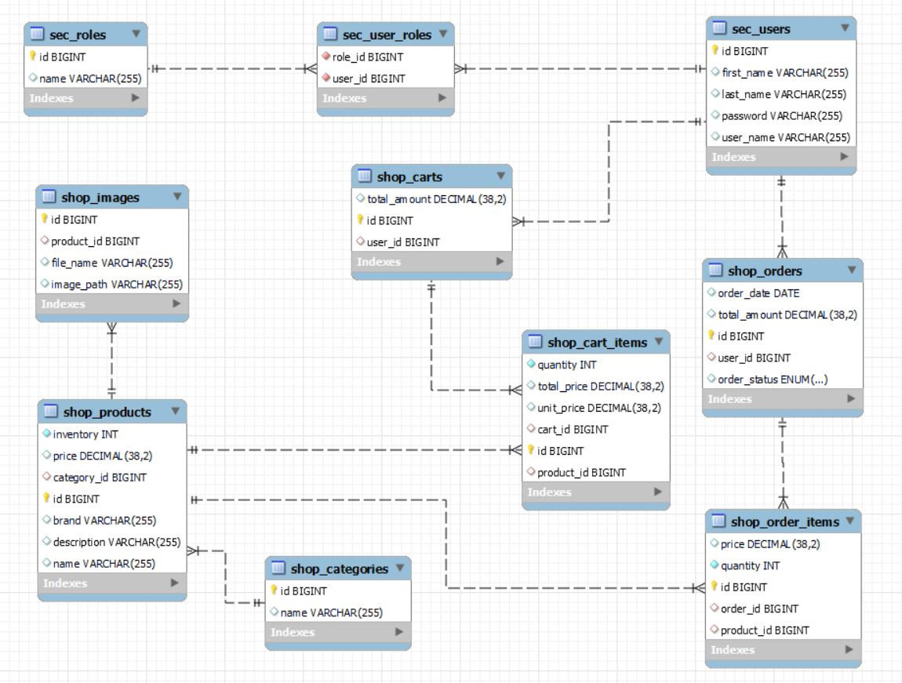

# E-Commerce Shopping Management System

This project is a shopping management system developed using Spring Boot. It provides a robust foundation for managing an online store with features like handling carts, orders, and products.

## Features
- **Entities:** Includes core entities such as `Cart`, `CartItem`, `Order`, `OrderItem`, and `Product`, with well-defined relationships.
- **Architecture:** Follows a multi-tier architecture with Repository, Service, and Controller handling different responsibilities.

## Layers Overview
### Repository Layer
The Repository Layer in Spring Boot is responsible for interacting with the database. It abstracts the data access logic and provides methods to perform CRUD (Create, Read, Update, Delete) operations on entities.

### Service Layer
The Service Layer is responsible for business logic. It mediates between the Controller and Repository layers, ensuring that application-specific logic is encapsulated and reusable.

### Controller Layer
The Controller Layer handles HTTP requests and acts as the application entry point. It interacts with the Service Layer to process requests and return responses.

## Database Design
The following Entity-Relationship (ER) diagram illustrates the database schema used in this project:

### Overview:
- **Security Tables**:
  - `sec_users`, `sec_roles`, and `sec_user_roles` manage user authentication and authorization.
- **Shop Tables**:
  - `shop_products`, `shop_categories`, `shop_images` define product details and organization.
  - `shop_carts`, and `shop_cart_items` manage user carts and items.
  - `shop_orders`, and `shop_order_items` handle orders and their respective items.

This design ensures efficient management of users, products, carts, and orders.

## Technologies Used
- **Framework:** Spring Boot  
- **Database:** MySQL (with HikariCP connection pooling)  
- **API Style:** RESTful  
